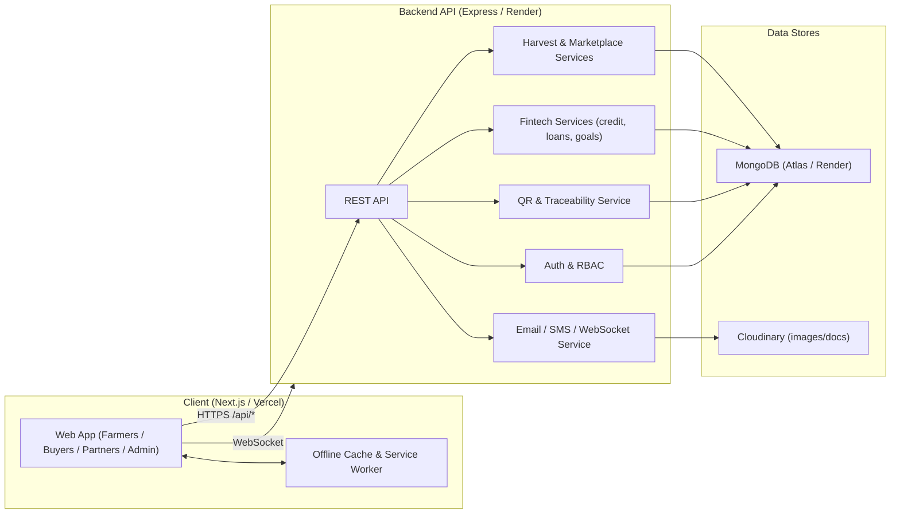
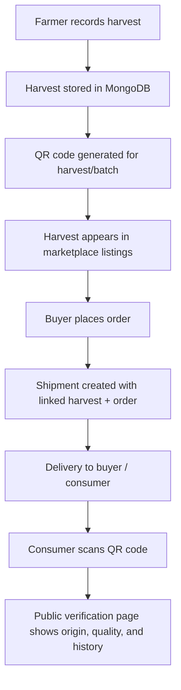
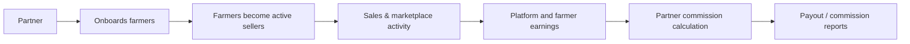

## GroChain – Agricultural Digital Trust & Traceability Platform

GroChain is a **digital trust platform for agriculture in Nigeria**, built to make the entire value chain—from farm to consumer—**transparent, efficient, and financially inclusive**.

It connects **farmers, buyers, partners/agents, and administrators** through:
- A **role-based dashboard** experience (farmer, buyer, partner, admin)
- A **digital marketplace** for verified agricultural produce
- **Financial tools** (credit scoring, loans, goals, insurance, transactions)
- **QR-based traceability** for every harvest and shipment
- **Analytics dashboards** for real-time visibility and decision-making

This document describes the project in depth, including:
- The **problem** GroChain solves and why it matters
- The **current implementation** and **core features**
- The **architecture & technology stack**
- **Sustainability and social impact**
- The **roadmap** (what is partial / planned vs already done)
- How to **install, configure, and run** the project locally and in production

> **Author**: Ridwanullahi Adam  
> **License**: MIT (see `LICENSE`)  
> **Last updated**: 10 February 2026

---

### Table of Contents

1. [Problem & Vision](#problem--vision)
2. [Solution Overview](#solution-overview)
3. [Architecture](#architecture)
4. [Core Domains & Features](#core-domains--features)
5. [Role-Based Capabilities](#role-based-capabilities)
6. [Sustainability & Impact](#sustainability--impact)
7. [Current Implementation vs Roadmap](#current-implementation-vs-roadmap)
8. [Project Structure](#project-structure)
9. [Technology Stack](#technology-stack)
10. [Environment Configuration](#environment-configuration)
11. [Running the Project Locally](#running-the-project-locally)
12. [Docker & Production Deployment](#docker--production-deployment)
13. [Authentication, Authorization & Security](#authentication-authorization--security)
14. [Key Application Flows](#key-application-flows)
15. [Offline & PWA Behaviour](#offline--pwa-behaviour)
16. [Contribution Guidelines](#contribution-guidelines)
17. [License](#license)

---

## Problem & Vision

### The Problem: Food Insecurity & Fragmented Value Chains

Nigeria faces a **systemic food security challenge** driven by:
- **Supply chain fragmentation** – too many intermediaries take 40–60% of farmer value.
- **Opaque value chains** – consumers cannot easily verify origin, quality, or authenticity.
- **Limited market access** – smallholder farmers lack direct access to buyers at fair prices.
- **Financial exclusion** – 70%+ of farmers lack access to formal credit and insurance.
- **High post-harvest losses** – poor logistics and storage destroy up to 40% of harvested produce.

These factors together:
- Depress **farmer income**
- Increase **consumer prices**
- Undermine **trust and safety** in agricultural products
- Limit **investment and productivity** across the sector

### GroChain’s Vision

GroChain’s vision is to become **Nigeria’s agricultural digital trust layer**:

- **End‑to‑end traceability** from farmer to final consumer, powered by QR codes
- **Digital identities** for farmers, buyers, and partners
- **Integrated fintech rails** – credit scoring, loans, payments, and commissions
- **Data-driven insights** and analytics for all stakeholders
- A **sustainable and inclusive ecosystem** that scales across all 36 states and beyond

For a deep strategic and impact narrative, see `Grochain-App-Details.md`.

---

## Solution Overview

At a high level, GroChain provides:

- **Multi-role dashboards** (farmer, buyer, partner, admin) with tailored analytics and tools
- A **digital marketplace** where farmers list harvests/products and buyers place orders
- **Harvest management** with quality metrics, organic certification flags, and traceability
- **QR code generation and verification** for harvest batches and shipments
- **Financial tools**: credit views, loan requests, financial goals, insurance and transaction history
- **Logistics & shipments** management, including tracking status and associated orders
- **Real-time analytics** dashboards for platform health and performance
- **Notifications** via email, SMS, and WebSockets (real-time events)

The platform is designed as a **modern web application**:
- **Frontend**: Next.js (App Router) deployed on Vercel
- **Backend**: Node.js/Express REST API with MongoDB, deployed on Render
- **API Gateway**: Vercel routes proxy `/api/*` to the backend on Render

---

## Architecture

### High-Level System Diagram



### Deployment Topology

- **Vercel** builds and hosts the `client/` Next.js app using `vercel.json`.
  - Routes:
    - `/api/(.*)` → `https://grochain-project.onrender.com/api/$1`
    - All other routes → `/client/$1`
- **Render** hosts the `backend/` Express API using `backend/render.yaml`.
  - Connected to a managed **MongoDB** instance.
  - Email, SMS, and other environment variables configured in Render dashboard.

---

## Core Domains & Features

### Domain Overview

| Domain                | Description                                                                                  |
|-----------------------|----------------------------------------------------------------------------------------------|
| **Marketplace**       | Listings, product discovery, cart, checkout, and orders between farmers and buyers          |
| **Harvests**          | Capture harvest data, quality, organic flag, GPS info, and approvals                        |
| **Finance**           | Credit view, loans, savings goals, transactions, and (planned) insurance                    |
| **QR & Traceability** | Generate QR codes for harvests/shipments; public verification of product history            |
| **Shipments**         | Link orders and harvests to shipments; track shipping status                                |
| **Commissions**       | Partner referral tracking, commission reporting, and real-time updates                      |
| **Analytics**         | Role-based analytics dashboards for performance, revenue, and operations                    |
| **User Management**   | Onboarding, role-specific profiles, farmer network management by partners, admin controls   |
| **Settings & System** | Platform configuration, notifications, security-related toggles, and system-level insights  |

---

## Role-Based Capabilities

GroChain is explicitly **role-aware**. The main roles are:
- `farmer`
- `buyer`
- `partner`
- `admin`

### Feature Matrix

| Area / Feature                      | Farmer | Buyer | Partner | Admin |
|-------------------------------------|:------:|:-----:|:-------:|:-----:|
| Dashboard overview                  |   ✅   |  ✅   |   ✅    |  ✅   |
| Harvest CRUD                        |   ✅   |  ❌   |   ✅\*  |  ✅\* |
| Marketplace listings                |   ✅   |  ✅   |   ✅    |  ✅   |
| Cart & checkout                     |   ❌   |  ✅   |   ❌    |  ❌   |
| Orders (view & manage)             |   ✅   |  ✅   |   ✅    |  ✅   |
| Shipments (create & track)         |   ✅   |  ✅   |   ✅    |  ✅   |
| QR code generation (harvest/batch)  |   ✅   |  ❌   |   ✅    |  ✅   |
| QR verification (scanner)          |   ✅   |  ✅   |   ✅    |  ✅   |
| Financial views (credit, loans...)  |   ✅   |  ✅   |   ✅    |  ✅   |
| Commission tracking                 |   ❌   |  ❌   |   ✅    |  ✅   |
| Farmer onboarding & management      |   ❌   |  ❌   |   ✅    |  ✅   |
| User management (all roles)         |   ❌   |  ❌   |   ❌    |  ✅   |
| System configuration                |   ❌   |  ❌   |   ❌    |  ✅   |

\*Partners and admins have **approval and oversight** capabilities around harvests, not day-to-day data entry.

### Dashboard Highlights

- **Farmer Dashboard**
  - Upcoming and recent **harvests**
  - Active **marketplace listings**
  - Earnings snapshots and financial widgets

- **Buyer Dashboard**
  - Active and previous **orders**
  - Supply reliability and vendor insights
  - Quick access to **marketplace browsing**

- **Partner Dashboard**
  - Network performance (farmers onboarded, activity)
  - **Commission** summaries
  - Approval queues and activity feeds

- **Admin Dashboard**
  - Platform-wide metrics (users, orders, harvests, revenue)
  - **User management** tools
  - Access to all domain sections (reports, system health, logs)

---

## Sustainability & Impact

Sustainability is built into GroChain at both the **data model** and **workflow** levels:

- **Environmental tracking**:
  - `carbonFootprint` and `waterUsage` fields defined for harvests (backend model)
  - `organicCertified` and `fairTrade` flags to highlight sustainable practices
- **Reduced waste**:
  - Digital harvest tracking and inventory views reduce post-harvest loss and overproduction.
  - Demand-driven marketplace helps align production with real orders.
- **Fairer economics**:
  - Direct farmer-to-buyer interactions improve farmer margins.
  - Transparent commission systems avoid hidden extraction.
- **Social inclusion**:
  - Mobile-first UI, with groundwork laid for USSD and local-language accessibility.
  - Strong focus on smallholder farmers and rural communities.

While some advanced features (full environmental analytics dashboards, deep IoT integration, blockchain) are **roadmap items**, the **current implementation already supports**:
- Basic **organic certification tracking**
- Structured **harvest and logistics** data
- Role-based analytics to monitor performance and impact

For the full impact story and long-term vision, see `Grochain-App-Details.md`.

---

## Current Implementation vs Roadmap

The codebase includes both **fully implemented features** and **planned/partial** ones. This section separates them clearly.

### Major Implemented Features

| Area                | Status      | Notes                                                                 |
|---------------------|------------|-----------------------------------------------------------------------|
| Role-based auth     | ✅ Stable   | JWT-based auth with robust RBAC and permissions                      |
| Farmer dashboard    | ✅ Stable   | Harvests, listings, shipments, basic analytics                        |
| Buyer dashboard     | ✅ Stable   | Orders, marketplace access, QR verification                           |
| Partner dashboard   | ✅ Stable   | Farmer network, commissions, approvals                               |
| Admin dashboard     | ✅ Stable   | Platform metrics, user management, approvals                         |
| Harvests CRUD       | ✅ Stable   | New/edit views, listing, details, approval workflows                 |
| Marketplace         | ✅ Stable   | Product listing, search/filter, buy flow, orders                     |
| Shipments           | ✅ Stable   | Shipments pages and backend linkage to orders/harvests               |
| QR generation       | ✅ Stable   | QR code creation for harvest/traceability                            |
| QR scanner          | ✅ Stable   | Frontend QR scanner using camera                                     |
| Email notifications | ✅ Stable   | SendGrid-based emails via Render                                     |
| Payments (base)     | ✅ Stable   | Paystack and Flutterwave integrations implemented on backend         |
| Analytics (client)  | ✅ Stable   | Role-specific analytics components and charts                        |
| PWA groundwork      | ✅ Stable*  | Service worker, offline page implemented; may be disabled on Vercel  |

\*PWA is technically implemented but **production PWA is disabled** on Vercel builds to avoid deployment issues; it can be re-enabled when needed.

### Partial / In-Progress / Stubbed Features

| Feature / Area                       | Status        | Notes & References (examples)                                                    |
|-------------------------------------|--------------|----------------------------------------------------------------------------------|
| Order tracking (carrier-level)     | ⚠️ Partial    | Returns basic order status; no full logistics provider integration yet          |
| User export (CSV/URL)              | ⚠️ Stub       | Endpoint returns `url: null` with \"Not yet implemented\" message                |
| Some admin partner stats           | ⚠️ Partial    | `totalUsersManaged` and similar fields may be hard-coded or placeholder values  |
| Referral performance analytics     | ⚠️ Partial    | Placeholder return structures in referral controller                            |
| USSD integration                   | ⚠️ Planned    | Service/controller exist; routes not wired into main Express app                |
| BVN verification                   | ⚠️ Planned    | Controller present; not fully wired into routing or UI                          |
| Full sustainability metrics UI     | ⚠️ Planned    | `carbonFootprint`/`waterUsage` available in models but not fully surfaced in UI |
| Onboarding/QR in sidenavs         | ⚠️ Partial    | Certain navigation items are commented out in dashboard layout                  |
| Advanced AI/ML & blockchain stack | ⚠️ Vision     | Described in vision docs; not fully implemented in current codebase             |

### Roadmap (High-Level)

1. **Short Term**
   - Wire up USSD flow and BVN verification to production APIs and UI.
   - Complete CSV/URL export for admins.
   - Extend analytics to highlight environmental metrics (carbon, water).
   - Re-enable PWA for production with careful Vercel configuration.

2. **Medium Term**
   - Deeper financial products (insurance, structured lending).
   - Stronger logistics integration for real carrier tracking.
   - Rich sustainability dashboards with trend lines and alerts.

3. **Long Term**
   - AI-assisted decision-making (yield predictions, risk scoring).
   - Gradual introduction of blockchain-backed traceability where appropriate.
   - IoT and satellite integrations for field-level monitoring.

---

## Project Structure

High-level structure:

```text
GroChain_Project/
  backend/           # Express API, models, controllers, routes, services
  client/            # Next.js 15 application (App Router)
  Grochain-App-Details.md
  vercel.json        # Vercel routing + build config for frontend
  backend/render.yaml# Render config for backend deployment
  docker-compose.yml # Local multi-service setup
  Dockerfile*        # Docker builds for backend/client (if present)
```

Selected frontend route structure (dashboard):

```text
client/app/dashboard/
  analytics/
  approvals/
  cart/
  commissions/
  farmers/
  favorites/
  financial/
    credit/
    goals/
    insurance/
    loans/
    transactions/
  harvests/
    new/
    [id]/
    [id]/edit/
  marketplace/
  onboarding/
  orders/
  products/
  qr-codes/
  scanner/
  shipments/
  settings/
  system/
  users/
  ...
```

---

## Technology Stack

### Backend (`backend/`)

- **Runtime**: Node.js (>= 18)
- **Framework**: Express
- **Database**: MongoDB (via Mongoose)
- **Auth & Security**:
  - JWT access and refresh tokens
  - Role-based access control (RBAC)
  - Input validation with Joi and other helpers
  - Helmet, rate limiting, and logging (Pino + Morgan)
- **Messaging & Notifications**:
  - Email via SendGrid (primary), with Resend/SMTP as fallbacks
  - SMS via Twilio (where configured)
  - Real-time events via Socket.IO
- **Payments**:
  - Paystack
  - Flutterwave
- **File & Media**:
  - Cloudinary-backed uploads for images/documents
  - Multer storage configuration
- **Utilities**:
  - `node-cron` for scheduled jobs
  - CSV/Excel import/export tools
  - QR code generation (`qrcode`)

### Frontend (`client/`)

- **Framework**: Next.js 15 (App Router)
- **UI & Design**:
  - Tailwind CSS 4
  - Shadcn/UI-style primitives via Radix UI
  - Icons via Lucide
  - Animations via `tailwindcss-animate` and related tooling
- **State & Data**:
  - Zustand for global auth/session stores and some UI state
  - React Query & SWR for frontend data fetching and caching
  - React Hook Form + Zod for forms and validation
- **Charts & Analytics**:
  - Recharts for charts and visualizations
- **PWA / Offline**:
  - `next-pwa` service worker integration
  - Custom offline page and fallback script in `public/`
- **Real-Time UX**:
  - `socket.io-client` for live updates

---

## Environment Configuration

### Backend Environment Variables (Render / Local)

The following are representative (not exhaustive). See `backend/render.yaml` plus `.env.example` (if present) for full details.

| Variable                | Purpose                                               |
|-------------------------|-------------------------------------------------------|
| `NODE_ENV`             | Environment (`development`, `production`)             |
| `PORT`                 | Backend HTTP port                                     |
| `MONGODB_URI`          | MongoDB connection string                             |
| `CORS_ORIGIN`          | Allowed origin (e.g. Vercel frontend URL)            |
| `FRONTEND_URL`         | Base URL of the frontend                              |
| `JWT_SECRET`           | Access token secret                                   |
| `JWT_REFRESH_SECRET`   | Refresh token secret                                  |
| `EMAIL_PROVIDER`       | `sendgrid` / `resend` / `smtp`                        |
| `SENDGRID_API_KEY`     | SendGrid API key                                      |
| `SENDGRID_FROM_EMAIL`  | Default From email                                    |
| `SENDGRID_FROM_NAME`   | Default From name                                     |
| `RESEND_API_KEY`       | Resend API key (optional backup)                      |
| `RESEND_FROM_EMAIL`    | Resend From email                                     |
| `SMTP_HOST`, `SMTP_*`  | SMTP fallback config                                  |
| `PAYSTACK_PUBLIC_KEY`  | Paystack public key                                   |
| `PAYSTACK_SECRET_KEY`  | Paystack secret key                                   |
| `FLUTTERWAVE_*`        | Flutterwave integration keys                          |
| `TWILIO_*`             | Twilio SMS config                                     |
| `CLOUDINARY_*`         | Cloudinary (cloud name, key, secret)                  |
| `QR_SECRET_KEY`        | Secret for signing/verifying QR code payloads         |
| `RATE_LIMIT_ENABLED`   | Toggle for API rate limiting                          |
| `ENABLE_SAMPLE_DATA`   | Seed or return sample data in some financial endpoints|

### Frontend Environment Variables (Vercel / Local)

| Variable                               | Purpose                                            |
|----------------------------------------|----------------------------------------------------|
| `NEXT_PUBLIC_API_BASE_URL`            | Base URL for backend API                           |
| `NEXT_PUBLIC_WS_URL`                  | WebSocket (Socket.IO) URL                          |
| `NEXT_PUBLIC_GOOGLE_CLIENT_ID`        | Google OAuth client ID                             |
| `NEXT_PUBLIC_GOOGLE_REDIRECT_URI`     | Redirect URL for Google auth                       |
| `NEXT_PUBLIC_ENABLE_PWA`              | Enable/disable PWA build                            |
| `NEXT_PUBLIC_ENABLE_OFFLINE_MODE`     | Toggle offline-first behavior                      |

> **Tip**: Keep secrets on **Render/Vercel dashboards** and out of git.

---

## Running the Project Locally

You can run the **backend** and **frontend** separately during development.

### 1. Clone the Repository

```bash
git clone <your-repo-url> GroChain_Project
cd GroChain_Project
```

### 2. Backend Setup (`backend/`)

```bash
cd backend
npm install

# copy or create .env
cp .env.example .env  # if present; otherwise create manually

# run in development mode
npm run dev
```

The backend will typically boot on `http://localhost:10000` or `http://localhost:5000` depending on your `PORT` configuration.

### 3. Frontend Setup (`client/`)

In a new terminal:

```bash
cd client
npm install

# configure env
cp .env.local.example .env.local  # if present; otherwise create manually

npm run dev
```

The Next.js app usually runs on `http://localhost:3000`.

Configure:
- `NEXT_PUBLIC_API_BASE_URL` to point to your backend (e.g. `http://localhost:10000/api`)
- `NEXT_PUBLIC_WS_URL` to `ws://localhost:10000` (or the correct backend WebSocket URL)

### 4. Running Tests & Lint

**Backend:**

```bash
cd backend
npm test              # Jest test suite
npm run test:health   # Health check tests
npm run lint          # ESLint
```

**Frontend:**

```bash
cd client
npm test        # Jest + React Testing Library
npm run lint    # Next.js ESLint
```

---

## Docker & Production Deployment

### Local Docker (Full Stack)

If `docker-compose.yml` is configured for this project, you can run both backend and frontend together:

```bash
docker-compose up --build
```

This typically:
- Builds backend and frontend images
- Starts Nginx or a reverse proxy (if defined)
- Exposes:
  - Frontend on `http://localhost:80` or `http://localhost:3000`
  - Backend on an internal port (e.g. `5000` or `10000`)

### Vercel (Frontend)

- `vercel.json` points Vercel to:
  - Build using `client/package.json` with `@vercel/next`
  - Proxy all `/api/*` routes to the Render backend

Deploy steps (high-level):
1. Connect the repository to Vercel.
2. Set frontend environment variables in Vercel dashboard.
3. Ensure `NEXT_PUBLIC_API_BASE_URL` matches your Render backend base URL.
4. Deploy.

### Render (Backend)

The `backend/render.yaml` file configures:
- Node environment
- `buildCommand: npm install`
- `startCommand: npm start`
- MongoDB connection via Render’s managed databases
- Email configuration and other environment variables

Deploy steps (high-level):
1. Create a **Web Service** in Render, pointing to `backend/`.
2. Create or attach a **MongoDB** instance.
3. Configure environment variables (see table above).
4. Deploy.

---

## Authentication, Authorization & Security

### Auth Model

- **JWT-based authentication** with access and refresh tokens.
- Tokens are stored in secure cookies and/or local storage depending on frontend configuration.
- **Google OAuth** integration exists for social login flows.

### Roles & Permissions

Defined roles include:
- `farmer`
- `buyer`
- `partner`
- `admin`

The backend uses a combination of:
- `authenticate` middleware – validates and decodes JWT.
- `authorize(roles...)` – ensures that the current user has one of the required roles.
- `hasMinRole`, `hasPermission`, `canAccessResource` – helper utilities to enforce resource-level permissions.

Examples:
- Only **admins** can manage all users.
- **Partners** can manage farmers within their network.
- **Farmers** can manage only their own harvests and listings.

### Security Practices

- **Helmet** and **CORS** configured.
- **Rate limiting** supported via `express-rate-limit` and toggled using env flags.
- Sensitive data kept in environment variables.
- Basic XSS and input sanitation using libraries like `xss` and `isomorphic-dompurify` where relevant.

---

## Key Application Flows

### 1. Harvest to Consumer Traceability



**Key guarantees**:
- Every harvest and shipment can be associated with a unique QR code.
- Scanning a QR code reveals verified information from the backend.

### 2. Commission Flow (Partner Perspective)



Partners are incentivized to:
- Onboard and support more farmers.
- Maintain network quality and performance.

### 3. Financials Overview (High-Level)

- Farmers and buyers can:
  - View **credit history** and indicative scoring data (where enabled).
  - Track **transactions** and **earnings**.
  - View **goals** and (in roadmap) more advanced products like insurance.
- Payments are handled by integrating with **Paystack** and **Flutterwave** on the backend.

---

## Offline & PWA Behaviour

The frontend is built with **offline resilience** in mind:

- Service worker and PWA setup using `next-pwa`.
- Offline fallback page served when the user is disconnected.
- Cache strategies applied for static assets and some API responses.

> Note: In production (Vercel), PWA/offline mode may be disabled by configuration to reduce deployment friction. The code and configuration are in place and can be re-enabled as requirements solidify.

---

## Contribution Guidelines

### Development Standards

- **Code style**:
  - Use ESLint and Prettier configurations already present in `backend/package.json` and `client/package.json`.
  - Run `npm run lint` and (where relevant) `npm run format` before committing major changes.
- **Testing**:
  - Write unit tests for new business logic where practical.
  - Ensure existing tests pass in both `backend` and `client`.

### Recommended Workflow

1. Fork or create a feature branch from `main`.
2. Implement your feature or bug fix.
3. Run tests and lint checks.
4. Update documentation where applicable (including this `README.md` if behavior changes).
5. Open a pull request with:
   - Clear description of the change
   - Screenshots for significant UI changes
   - Notes on migrations or environment variable changes

---

## License

This project is licensed under the **MIT License**.  
See the [`LICENSE`](LICENSE) file for full details.

